<h2>EfficientNet-Histopathologic-Oral-Cancer(Updated: 2022/11/19)</h2>
<a href="#1">1 EfficientNetV2 Histopathologic Oral Cancer Classification </a> 
<a href="#1.1">1.1 Clone repository</a> 
<a href="#1.2">1.2 Prepare Oral-Cancer dataset</a> 
<a href="#1.3">1.3 Install Python packages</a> 
<a href="#2">2 Python classes for Oral-Cancer Classification</a> 
<a href="#3">3 Pretrained model</a> 
<a href="#4">4 Train</a> 
<a href="#4.1">4.1 Train script</a> 
<a href="#4.2">4.2 Training result</a> 
<a href="#5">5 Inference</a> 
<a href="#5.1">5.1 Inference script</a> 
<a href="#5.2">5.2 Sample test images</a> 
<a href="#5.3">5.3 Inference result</a> 
<a href="#6">6 Evaluation</a> 
<a href="#6.1">6.1 Evaluation script</a> 
<a href="#6.2">6.2 Evaluation result</a> 

<h2>
<a id="1">1 EfficientNetV2 Histopathologic Oral Cancer Classification</a>
</h2>

 This is an experimental EfficientNetV2 Histopathologic Oral Cancer Classification project based on <b>efficientnetv2</b> in <a href="https://github.com/google/automl">Brain AutoML</a>.
 

This image dataset used here has been taken from the following website: 
<a href="https://www.kaggle.com/datasets/ashenafifasilkebede/dataset">Histopathologic Oral Cancer Detection using CNNs</a><br<

Licence: 
<a href="https://creativecommons.org/publicdomain/zero/1.0/">CC0: Public Domain</a> 

 We use python 3.8 and tensorflow 2.8.0 environment on Windows 11. 
 

<h3>
<a id="1.1">1.1 Clone repository</a>
</h3>
 Please run the following command in your working directory: 
<pre>
git clone https://github.com/atlan-antillia/EfficientNet-Histopathologic-Oral-Cancer.git
</pre>
You will have the following directory tree: 
<pre>
.
├─asset
└─projects
    └─Oral-Cancer
        ├─eval
        ├─evaluation
        ├─inference
        ├─models
        ├─Oral_Cancer_Images
        └─test
</pre>
<h3>
<a id="1.2">1.2 Prepare Oracl_Cancer dataset</a>
</h3>
<b>
1. Downoad dataset 
</b>
The image dataset used here has been taken from the following website: <a href="https://github.com/MicheleDamian/prostate-gleason-dataset">MicheleDamian/prostate-gleason-dataset</a>
<a href="https://www.kaggle.com/datasets/ashenafifasilkebede/dataset">Histopathologic Oral Cancer Detection using CNNs</a> 

 
<pre>
Original_Oral_Cancer_Images
├─test
│  ├─Normal :num_images = 31
│  └─OSCC   :num_images = 95
├─train
│  ├─Normal :num_images = 2463
│  └─OSCC   :num_images = 2603
└─val
    ├─Normal :num_images = 28
    └─OSCC   :num_images = 92
    
</pre>
, where OSCC is Oral Squamous Cell Carcinoma.  

<b>
2. Merge test, train, and val to master 
</b>
The number of images of test and val directories seems to be too small to use for the validation and testing on this model training.
Therefore, we have merged those images to one master directory:

<pre>
Oral_Cancer_Images-master
└─master
    ├─Normal
    └─OSCC   
</pre>
    
<b>
3. Resize the master dataset 
</b>
Furthermore, we have created <b>Oral_Cancer_224x224_Images</b> dataset by using <a href="./projects/Oral-Cancer/resize.py">resize.py</a>
 script to resize all images in the master dataset to be the same 224x224. 

<pre>
Oral_Cancer_224x224_Images
└─master
    ├─Normal
    └─OSCC   
</pre>
<b>
4. Spit master dataset 
</b>
Finally we have created <b>Oral_Cancer_Images</b> dataset by applying <a href="./projects/Oral-Cancer/split_master.py">
split_master.py</a> script to the master dataset. 
<pre>
Oral_Cancer_Images
├─test
│  ├─Normal
│  └─OSCC
└─train
    ├─Normal
    └─OSCC
</pre>

The distribution of the number of images <b>Oral_Cancer_Images</b> dataset is the following. 
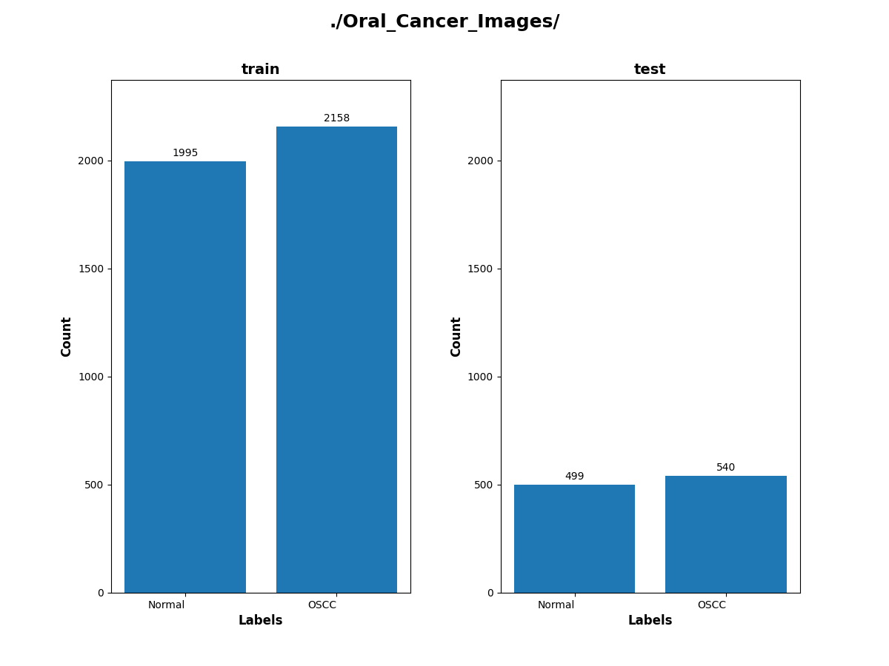 
 
 
Sample images of Oral_Cancer_Images/train/Normal 
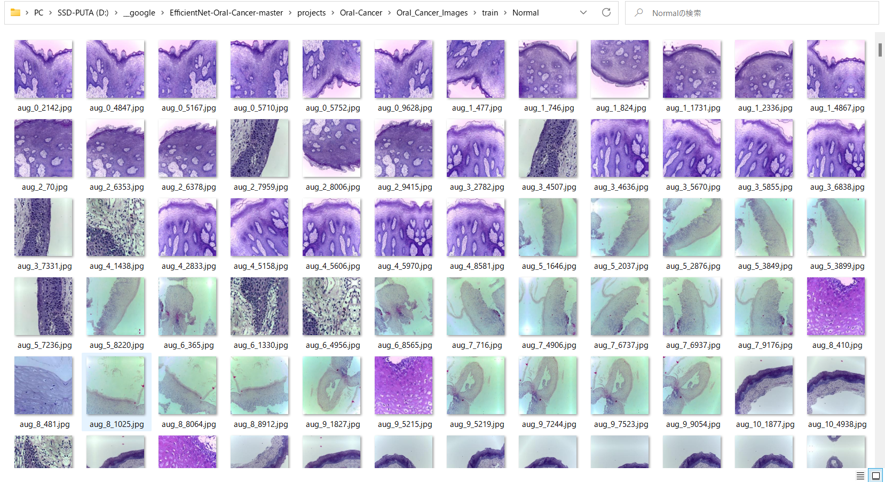 

 
Sample images of Oral_Cancer_Images/train/OSCC 
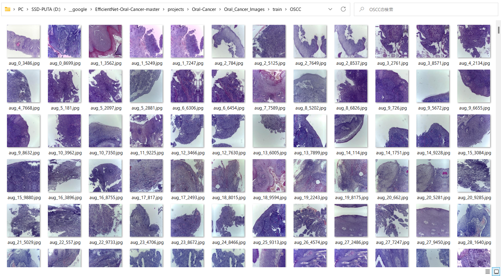 

 

<h3>
<a id="#1.3">1.3 Install Python packages</a>
</h3>
Please run the following commnad to install Python packages for this project. 
<pre>
pip install -r requirements.txt
</pre>
 

<h2>
<a id="2">2 Python classes for Oral-Cancer Classification</a>
</h2>
We have defined the following python classes to implement our Oral-Cancer Classification. 
<li>
<a href="./ClassificationReportWriter.py">ClassificationReportWriter</a>
</li>
<li>
<a href="./ConfusionMatrix.py">ConfusionMatrix</a>
</li>
<li>
<a href="./CustomDataset.py">CustomDataset</a>
</li>
<li>
<a href="./EpochChangeCallback.py">EpochChangeCallback</a>
</li>
<li>
<a href="./EfficientNetV2Evaluator.py">EfficientNetV2Evaluator</a>
</li>
<li>
<a href="./EfficientNetV2Inferencer.py">EfficientNetV2Inferencer</a>
</li>
<li>
<a href="./EfficientNetV2ModelTrainer.py">EfficientNetV2ModelTrainer</a>
</li>
<li>
<a href="./FineTuningModel.py">FineTuningModel</a>
</li>

<li>
<a href="./TestDataset.py">TestDataset</a>
</li>

<h2>
<a id="3">3 Pretrained model</a>
</h2>
 We have used pretrained <b>efficientnetv2-b0</b> model to train Oral-Cancer Classification FineTuning Model.
Please download the pretrained checkpoint file from <a href="https://storage.googleapis.com/cloud-tpu-checkpoints/efficientnet/v2/efficientnetv2-b0.tgz">efficientnetv2-b0.tgz</a>, expand it, and place the model under our top repository.

<pre>
.
├─asset
├─efficientnetv2-b0
└─projects
    └─Oral-Cancer
  ...
</pre>

<h2>
<a id="4">4 Train</a>

</h2>
<h3>
<a id="4.1">4.1 Train script</a>
</h3>
Please run the following bat file to train our Oral-Cancer Classification efficientnetv2 model by using
<a href="./projects/Oral-Cancer/Oral_Cancer_Images/train">Oral_Cancer_Images/train</a>.
<pre>
./1_train.bat
</pre>
<pre>
rem 1_train.bat
python ../../EfficientNetV2ModelTrainer.py ^
  --model_dir=./models ^
  --eval_dir=./eval ^
  --model_name=efficientnetv2-b0  ^
  --data_generator_config=./data_generator.config ^
  --ckpt_dir=../../efficientnetv2-b0/model ^
  --optimizer=rmsprop ^
  --image_size=224 ^
  --eval_image_size=224 ^
  --data_dir=./Oral_Cancer_Images/train ^
  --data_augmentation=True ^
  --valid_data_augmentation=True ^
  --fine_tuning=True ^
  --monitor=val_loss ^
  --learning_rate=0.0001 ^
  --trainable_layers_ratio=0.4 ^
  --dropout_rate=0.2 ^
  --num_epochs=50 ^
  --batch_size=8 ^
  --patience=10 ^
  --debug=True 
</pre>
, where data_generator.config is the following: 
<pre>
; data_generation.config

[training]
validation_split   = 0.2
featurewise_center = Fale
samplewise_center  = False
featurewise_std_normalization=True
samplewise_std_normalization =False
zca_whitening                =False
rotation_range     = 20
horizontal_flip    = True
vertical_flip      = True
width_shift_range  = 0.1
height_shift_range = 0.1
shear_range        = 0.01
zoom_range         = [0.2, 2.0]
data_format        = "channels_last"

[validation]
validation_split   = 0.2
featurewise_center = False
samplewise_center  = False
featurewise_std_normalization=True
samplewise_std_normalization =False
zca_whitening                =False
rotation_range     = 20
horizontal_flip    = True
vertical_flip      = True
width_shift_range  = 0.1
height_shift_range = 0.1
shear_range        = 0.01
zoom_range         = [0.2, 2.0]
data_format        = "channels_last"
</pre>

<h3>
<a id="4.2">4.2 Training result</a>
</h3>

This will generate a <b>best_model.h5</b> in the models folder specified by --model_dir parameter. 
Furthermore, it will generate a <a href="./projects/Oral-Cancer/eval/train_accuracies.csv">train_accuracies</a>
and <a href="./projects/Oral-Cancer/eval/train_losses.csv">train_losses</a> files
 
Training console output: 
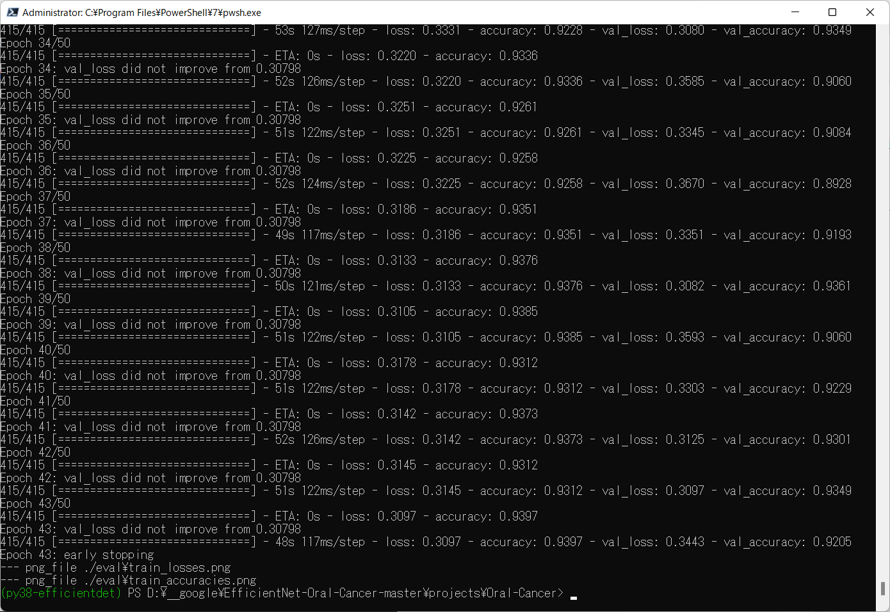 
 
Train_accuracies: 
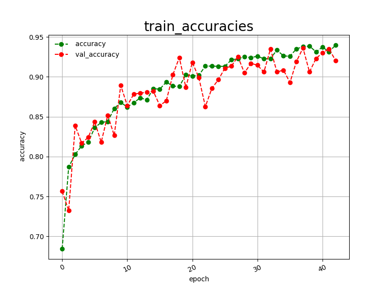 

 
Train_losses: 
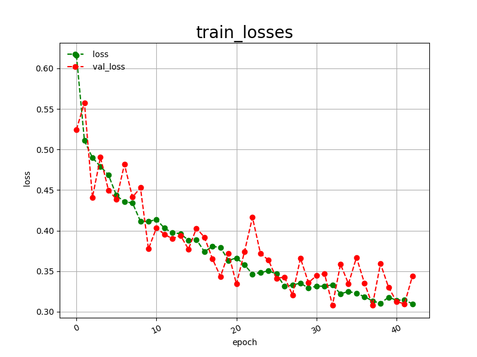 

 
<h2>
<a id="5">5 Inference</a>
</h2>
<h3>
<a id="5.1">5.1 Inference script</a>
</h3>
Please run the following bat file to infer the breast cancer in test images by the model generated by the above train command. 
<pre>
./2_inference.bat
</pre>
<pre>
rem 2_inference.bat
python ../../EfficientNetV2Inferencer.py ^
  --model_name=efficientnetv2-b0  ^
  --model_dir=./models ^
  --fine_tuning=True ^
  --trainable_layers_ratio=0.4 ^
  --dropout_rate=0.2 ^
  --image_path=./test/*.jpg ^
  --eval_image_size=480 ^
  --label_map=./label_map.txt ^
  --mixed_precision=True ^
  --infer_dir=./inference ^
  --debug=False 
 </pre>
 
label_map.txt:
<pre>
Normal
OSCC
</pre>
 
<h3>
<a id="5.2">5.2 Sample test images</a>
</h3>

Sample test images generated by <a href="./projects/Oral-Cancer/create_test_dataset.py">create_test_dataset.py</a> 
from <a href="./projects/Oral-Cancer/Oral_Cancer_Images/test">Oral_Cancer_Imagess/test</a>.
 
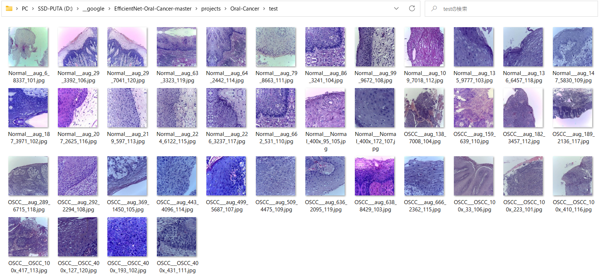 

<h3>
<a id="5.3">5.3 Inference result</a>
</h3>
This inference command will generate <a href="./projects/Oral-Cancer/inference/inference.csv">inference result file</a>.
 
 
Inference console output: 
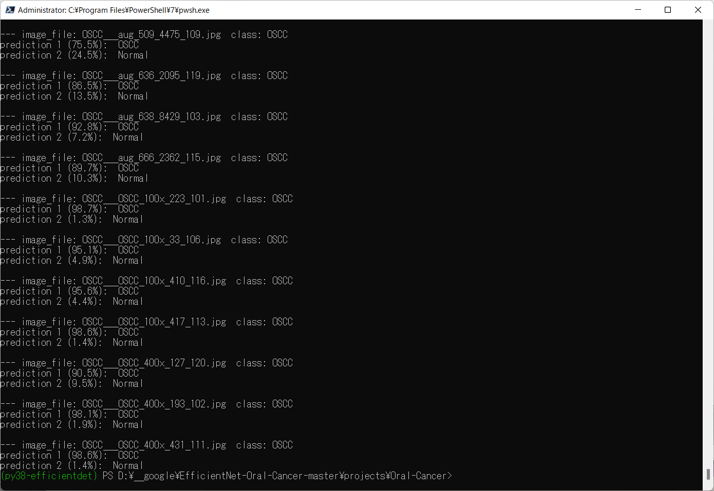 
 

Inference result (inference.csv): 
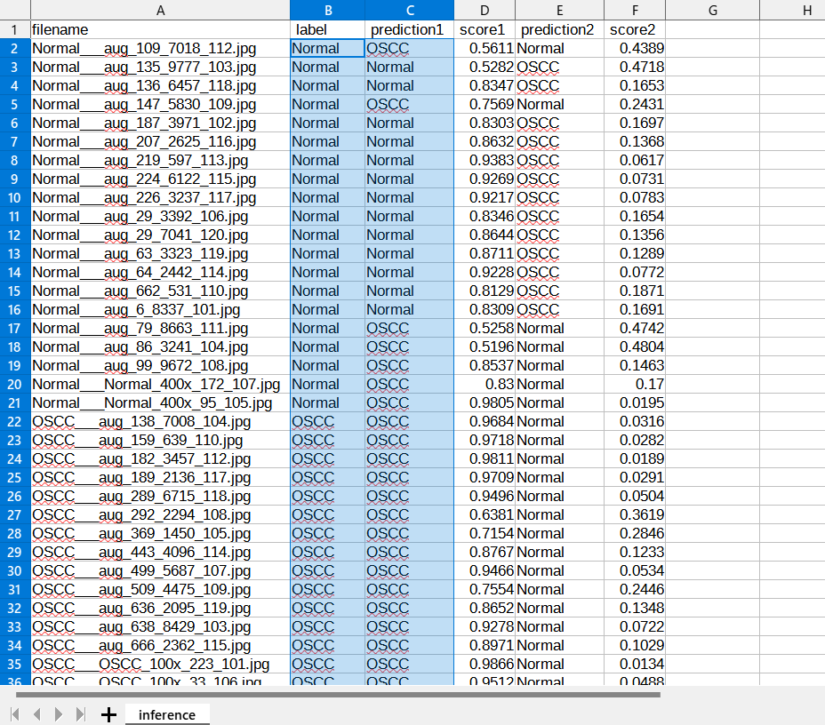 
 
<h2>
<a id="6">6 Evaluation</a>
</h2>
<h3>
<a id="6.1">6.1 Evaluation script</a>
</h3>
Please run the following bat file to evaluate <a href="./projects/Oral-Cancer/Oral_Images/test">
Oral_Images/test</a> by the trained model. 
<pre>
./3_evaluate.bat
</pre>
<pre>
rem 3_evaluate.bat
python ../../EfficientNetV2Evaluator.py ^
  --model_name=efficientnetv2-b0  ^
  --model_dir=./models ^
  --data_dir=./Oral_Cancer_Images/test ^
  --evaluation_dir=./evaluation ^
  --fine_tuning=True ^
  --trainable_layers_ratio=0.4 ^
  --dropout_rate=0.2 ^
  --eval_image_size=224 ^
  --mixed_precision=True ^
  --debug=False 
</pre>
 

<h3>
<a id="6.2">6.2 Evaluation result</a>
</h3>

This evaluation command will generate <a href="./projects/Oral-Cancer/evaluation/classification_report.csv">a classification report</a>
 and <a href="./projects/Oral-Cancer/evaluation/confusion_matrix.png">a confusion_matrix</a>.
 
 
Evaluation console output: 
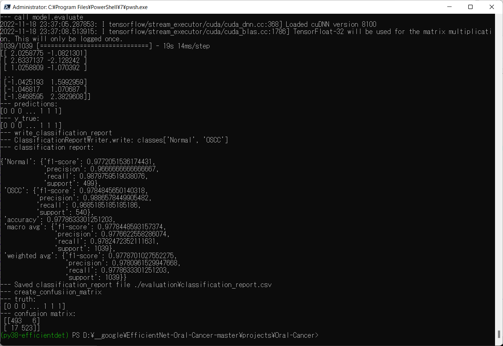 
 

 
Classification report: 
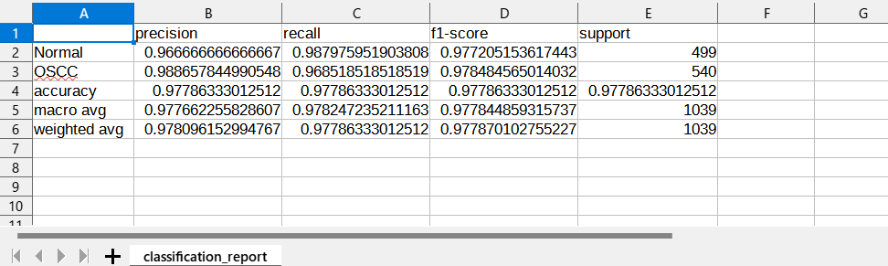 

 
Confusion matrix: 
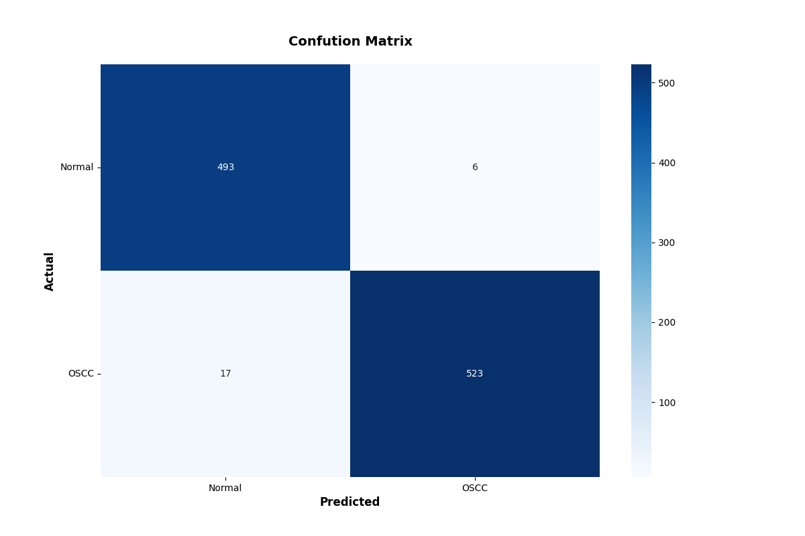 

 
<h3>
References
</h3>
<b>1. Histopathologic Oral Cancer Detection using CNNs</b> 
<pre>
https://www.kaggle.com/datasets/ashenafifasilkebede/dataset  
</pre>

<b>2. Histopathologic Oral Cancer Prediction Using Oral Squamous Cell Carcinoma Biopsy Empowered with Transfer Learning</b> 
Atta-ur Rahman,Abdullah Alqahtani,Nahier Aldhafferi,Muhammad Umar Nasir,Muhammad Farhan Khan,
Muhammad Adnan Khan and Amir Mosavi 
<pre>
https://www.mdpi.com/1424-8220/22/10/3833/htm
</pre>

